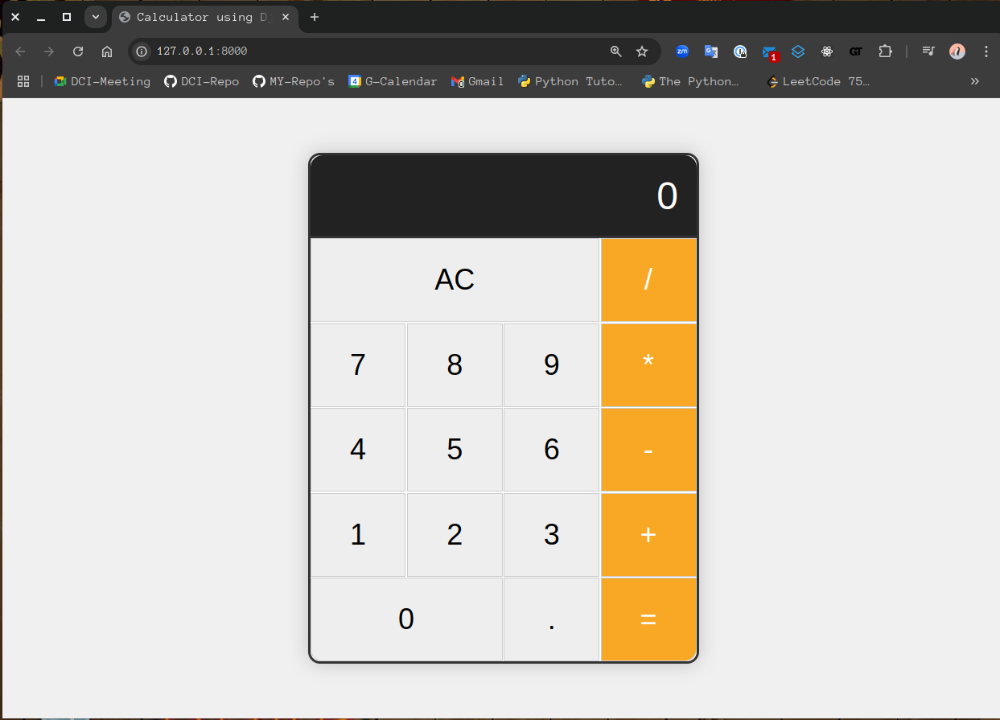

# Learn Django by Building a Calculator App


## Description

This project is a simple calculator app built with Django. It is a good project to learn Django because it is simple and easy to understand. The calculator app has the basic arithmetic operations: addition, subtraction, multiplication, and division.

## Setting up the project

Download the project files by running the following command:

```bash
git clone https://github.com/julioaranajr/Django_Calculator_App.git
```

1. Create a virtual environment:

```bash
python3 -m venv venv
```

2. Activate the virtual environment:

```bash
source venv/bin/activate
```

3. Install the dependencies:

```bash
pip install -r requirements.txt
```

4. Change the directory to the project folder:

```bash
cd Django_Calculator_App
```

5. Run the server:

```bash
python manage.py runserver
```

6. Open your browser and go to `http://localhost:8000/` to see the calculator app.

## Screenshots


